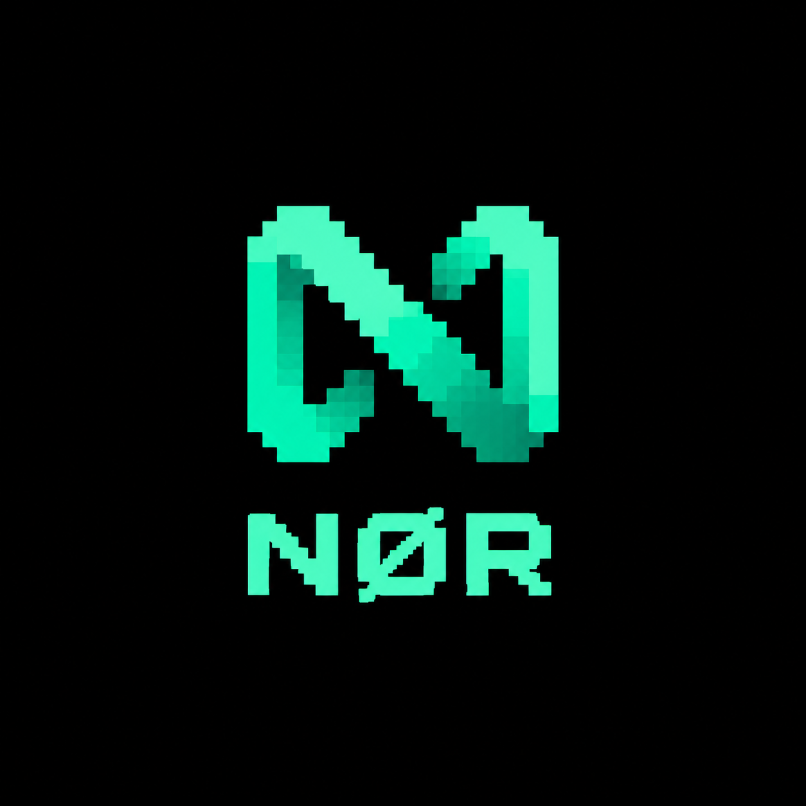

# NØR Protocol

CA: 2XNFAK3hvSwhjhuFEeygeHrM7xMh4wCMDVMKGz7Rpump

NØR (pronounced “nor”) is a Solana-native protocol inspired by the developer experience of NEAR: human-readable account names, predictable program-owned state, and simple composability. NØR is **not an official fork of NEAR Protocol** and does not reuse NEAR code. It is an independent Anchor/Rust implementation designed for Solana.

> Status: early development. Do not use with real funds.

## What NØR is for

NØR provides a foundation for Solana applications that want:

- readable `.nor` account aliases mapped to Solana public keys;
- program-owned account metadata and namespace ownership;
- deterministic PDAs for account records;
- an Anchor client surface that can be extended by wallets, explorers, and applications.

The first milestone is the **NØR Registry**. It stores a name, owner, target public key, and expiry in a PDA derived from the registry and normalized name. Transfers and renewals are intentionally explicit on-chain instructions.

## Repository layout

```text
programs/nor-registry/   Anchor program
logo/                    NØR brand mark
Anchor.toml              localnet/devnet configuration
Cargo.toml               Rust workspace
```

## Requirements

- Rust and Cargo
- Solana CLI
- Anchor CLI 0.30+
- Node.js 20+ and pnpm (for the optional TypeScript client/tests)

## Use NØR locally

```bash
# Clone the repository
git clone https://github.com/<your-org>/nor-protocol.git
cd nor-protocol

# Build the Solana program
anchor build

# Run the local validator and tests
anchor test
```

To deploy to Devnet, configure a funded wallet and run:

```bash
solana config set --url devnet
solana airdrop 2
anchor deploy
```

Never commit wallet keypairs, private keys, `.env` files, or funded credentials.

## Program instructions

The registry currently exposes:

- `initialize_registry()` — creates the registry configuration PDA.
- `register_name(name, target, duration)` — creates a name record owned by the signer.
- `renew_name(name, additional_duration)` — extends an owned record.
- `transfer_name(name, new_owner)` — transfers record ownership.

Names are normalized to lowercase ASCII before PDA derivation. The current prototype uses a fixed fee-free flow for local development; fees, rent policy, anti-squatting rules, and governance are not finalized.

## Roadmap

1. Registry program and deterministic account records
2. TypeScript client and SDK error types
3. Wallet and explorer integrations
4. Optional resolver records for application metadata
5. Audited fee, renewal, and governance design

## Contributing

Open an issue before large changes. Keep protocol changes backwards-compatible where possible, add Anchor tests for every instruction, and document account layouts and security assumptions.

## License

Apache-2.0. See [LICENSE](LICENSE).

## Disclaimer

NØR is experimental open-source software. It is not affiliated with, endorsed by, or a fork of the NEAR Foundation or NEAR Protocol. Use at your own risk.



© 2026 NØR contributors
